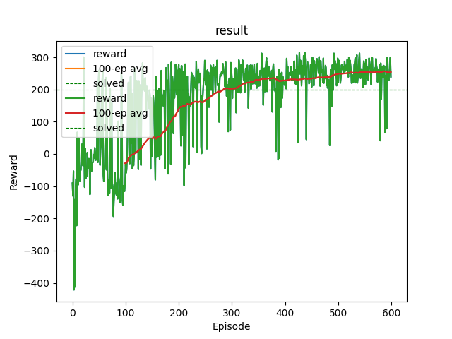

# Lunar Lander

A reinforcement learning project built from scratch, starting with a Deep Q-Network (DQN) that learns to land the [Gymnasium `LunarLander-v3`](https://gymnasium.farama.org/environments/box2d/lunar_lander/) spacecraft, and growing toward a self-built physics engine with a continuous-control PPO agent.

> **Status — this is an evolving workspace, not a finished project.**
> The DQN agent below is **implemented and working** (it solves the environment). The PPO agent and the custom physics engine described in the [Roadmap](#roadmap) are **planned and not yet built**. This repo will keep changing until that whole arc is done.

| Stage | What | Status |
|------|------|--------|
| 1 | DQN agent on discrete `LunarLander-v3` | ✅ Working — solves the env |
| 2 | PPO agent with continuous control (gimbal, thrust levels) | ⬜ Planned |
| 3 | 2D physics engine from scratch (C++ or Python) | ⬜ Planned |
| 4 | Run the PPO agent on the custom physics engine | ⬜ Planned |

---

## Why

The goal isn't to land a cartoon lander — that's a solved benchmark. The goal is to understand reinforcement learning and control deeply enough to build the whole stack myself: the agent *and* the world it acts in. `LunarLander` is the on-ramp because it's a standard, well-understood control problem. The later stages replace the prebuilt environment with one I've written from the ground up, which is where the real understanding gets tested.

Everything here is written by hand. No Stable-Baselines3 or other RL libraries — the replay buffer, target network, training loop, and update rule are all implemented directly in PyTorch. It's a standard DQN (not a novel algorithm), built from scratch to actually understand each moving part rather than call into a black box.

---

## What's working now: the DQN agent

A Deep Q-Network learns to land via trial and error. It sees the lander's 8-dimensional state (position, velocity, angle, angular velocity, and two leg-contact flags) and chooses one of 4 discrete actions (do nothing, fire left engine, fire main engine, fire right engine), learning over ~600 episodes which actions are worth taking in which states.

### How it works

The implementation is a from-scratch DQN with the standard stabilizing machinery:

- **Q-network** — a small MLP (`8 → 128 → 128 → 4`) that estimates the value of each action in a given state.
- **Replay buffer** — stores past transitions `(state, action, next_state, reward)` and samples random batches for training, so the network isn't fed a stream of highly correlated consecutive steps.
- **Target network** — a slowly-updated copy of the Q-network used to compute training targets. Without it, the network chases a target built from its own constantly-shifting predictions and tends to diverge.
- **Bellman target** — each action's value is trained toward `reward + γ · max Q_target(next_state)`. This is how the reward at the end of an episode (e.g. +100 for landing) propagates backward to teach the earlier actions that led there. Terminal states contribute zero future value.
- **ε-greedy exploration** — early on the agent acts mostly randomly to discover the environment; the random rate decays exponentially (0.9 → 0.01) toward acting on what it has learned.
- **Soft (Polyak) target updates** — every step, the target network is nudged a tiny fraction (`τ = 0.005`) toward the Q-network rather than copied wholesale, keeping the training target smooth and stable.
- **Huber loss** + gradient clipping for robustness to outlier targets.
- **Best-checkpoint saving** — the model is saved whenever an episode beats the best episode reward seen so far. *(Note: this saves on a single best episode, so the checkpoint can be slightly noisy — see [Notes](#notes--honest-limitations).)*

### Hyperparameters

| Param | Value |
|------|-------|
| Optimizer | AdamW (amsgrad), `lr = 3e-4` |
| Discount `γ` | 0.99 |
| Batch size | 128 |
| Replay capacity | 50,000 |
| ε start → end | 0.9 → 0.01 (decay 2500) |
| Target update `τ` | 0.005 (soft, every step) |
| Episodes | 600 |

---

## Project structure

```
lunar_lander/
├── DQN_testing/
│   ├── dqn_starter.py        # training loop — trains the agent and saves dqn_lander.pth
│   ├── dqn_in_action.py      # loads the saved agent, runs it greedily, records video
│   ├── dqn_lander.pth        # saved weights (best checkpoint from a training run)
│   └── dqn_result_plt.png    # reward curve from a full 600-episode run
├── dqn-lander-episode-1.mp4  # sample recording of a trained landing
└── README.md
```

---

## Tech stack

| Tool | Role |
|------|------|
| Python | Language |
| PyTorch | Network, training, autograd |
| Gymnasium + Box2D | `LunarLander-v3` environment & physics |
| Matplotlib | Live reward plotting during training |
| MoviePy | Encoding the recorded `.mp4` episodes |

---

## Setup

```bash
pip install "gymnasium[box2d]" torch matplotlib moviepy
```

`gymnasium[box2d]` pulls in the Box2D physics backend the lander needs. `moviepy` is only required for recording video (`dqn_in_action.py`).

---

## Usage

Both scripts use **relative paths** for the `dqn_lander.pth` checkpoint, so run them from inside `DQN_testing/`.

### Train

```bash
cd DQN_testing
python dqn_starter.py
```

This runs ~600 episodes (roughly 15–40 min on CPU; the network is tiny, so a GPU offers little benefit). A live Matplotlib window shows the per-episode reward, a 100-episode moving average, and the "solved" line at 200. The best agent is saved to `dqn_lander.pth` as training progresses.

### Watch / record a trained agent

```bash
cd DQN_testing
python dqn_in_action.py
```

This loads `dqn_lander.pth`, runs 5 episodes acting greedily (no exploration), prints each episode's reward, and writes one `.mp4` per episode into `lander_videos/`.

- As written, it uses `render_mode='rgb_array'` and the `RecordVideo` wrapper, so it **records to file without opening a live window** — watch the resulting `.mp4`s.
- To watch **live** instead, set `render_mode='human'` and remove the `RecordVideo` wrapper. (You can't do both on one environment — recording and the live window are mutually exclusive.)

---

## Results

Over a 600-episode run, the agent goes from crashing on contact to reliably landing:



- Episodes ~0–30: deep negative reward — crashing immediately.
- ~30–130: clawing up through the crash-and-hover regime.
- ~290: the **100-episode average crosses 200** — Gymnasium's "solved" threshold for this environment.
- ~290–600: the average drifts up and stabilizes around **~250**.

The raw per-episode reward stays noisy even after solving (the occasional dip is a bad starting condition or a stray exploration step), but the moving average — the metric that actually defines "solved" — sits comfortably above the line.

A sample landing is in [`dqn-lander-episode-1.mp4`](dqn-lander-episode-1.mp4).

---

## Roadmap

The DQN is the foundation, not the destination. Planned next, in order:

**1. PPO agent with continuous control.** DQN only works with a fixed menu of discrete actions, so it can't drive a real throttle or steer a gimbal — those are continuous quantities. The next agent will be a from-scratch PPO implementation (policy-based, on-policy, actor-critic) targeting continuous control: variable thrust levels and engine gimbal angle. The natural bridge is `LunarLanderContinuous-v3` — same environment, continuous action space — before moving to a custom one.

**2. A 2D physics engine from scratch.** A hand-written physics engine (gravity, thrust, collision, terrain) to replace the prebuilt Box2D environment. Language is still undecided — C++ or Python.

**3. Run the PPO agent on the custom engine.** The stage with the most uncertainty — but the difficulty isn't where it first appears. Wrapping a physics engine in a Gymnasium-style interface is mostly plumbing: an environment is just a class exposing an `observation_space`, an `action_space`, a `reset()`, and a `step(action)` that returns `(obs, reward, terminated, truncated, info)`. The genuinely hard parts are the ones the prebuilt environments quietly solved for you:

- **Reward design.** With `LunarLander` the reward was designed and tuned by others to make the task learnable. In a custom environment that's on me, and reward design has no answer key — make it too sparse and the agent never stumbles into success to learn from; make it subtly wrong and the agent exploits the reward instead of solving the task (reward hacking — e.g. learning to hover forever to avoid a crash penalty rather than landing).
- **Debugging ambiguity.** When a from-scratch PPO, a from-scratch physics engine, and a from-scratch reward all meet at once, a failure in any one looks identical to a failure in the others. Three home-built systems is three times the silent-failure surface.

The plan to keep this tractable is to validate each piece against a known-good reference *before* combining them: get PPO solving Farama's `LunarLanderContinuous` first (so any failure is the agent), unit-test the physics engine with scripted inputs (so any failure is the dynamics), and only then bolt the trusted pieces together — leaving the environment glue and the reward as the only new variables to debug.

---

## Notes & honest limitations

- This is a **standard DQN**, implemented from scratch for learning — not a novel method, and `LunarLander` is a well-known benchmark, not an original environment.
- It's **vanilla DQN** — no Double DQN, dueling architecture, or prioritized replay. Those would improve stability and sample efficiency but were intentionally left out to keep the core algorithm legible.
- It only handles **discrete actions**. Continuous control is the explicit reason PPO is next on the roadmap.
- The saved checkpoint is the **single best-scoring episode**, which can be a slightly lucky/noisy snapshot rather than the most consistently strong policy. Gating the save on the moving average would give a more reliably good agent.
- Like all RL, runs are **stochastic** — re-training will not reproduce the exact same curve, and vanilla DQN occasionally plateaus lower or takes a temporary dip before recovering.
